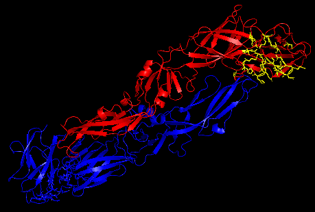
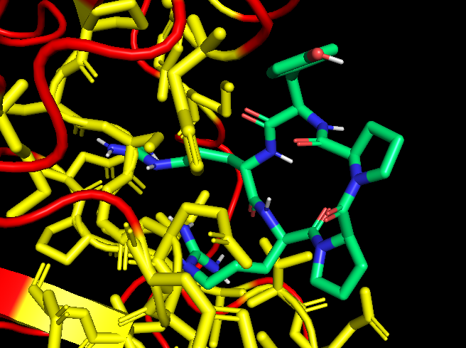

# Molecular Docking: DENV vs. PYRRP

En este repositorio se reproduce el trabajo del paper [The Computation of Cyclic Peptide with Prolin-Prolin Bond as Fusion Inhibitor of DENV Envelope Protein through Molecular Docking and Molecular Dynamics Simulation](https://arxiv.org/abs/1511.01388):

## Datos de partida

* [DENV envelope protein (1OAN)](https://pdbj.org/mine/summary/1OAN): homodímero de la envuelta vírica, proteína esencial en la formación de la cápside de nuevos virus del dengue. El paso de dímero a trímero es esencial en este proceso, y justo este paso es el que se trata de evitar a través de un ligando que estabilice el dímero impidiendo la formación del trímero.
* PYRRP: ligando orgánico cíclico computacionalmente conceptualizado en el paper. Su fórmula puede encontrarse en él. Fue el mejor ligando de todos los considerados de acuerdo a su afinidad por el sitio de unión designado en la proteína DENV, y por tanto un potencial candidato a inhibidor de la formación del trímero. Debido a la no disponibilidad, este compuesto fue generado a mano copiando la fórmula, exportado y equilibrado para su uso.

## Metodología

### Preparación
Se eliminan solventes, se añaden hidrógenos polares y se calculan cargas en ambas moléculas. En PYRRP, además, se establecen torsiones en aquellos enlaces que lo permitan.

De acuerdo al paper, los residuos 1, 143-149, 156, 158, 178, 295, 324, 333, 355-357, 359-366 conforman el candidato a bolsillo molecular a ocupar por PYRRP.

Dado que trabajamos con un dímero, estos residuos resultan en dos bolsillos moleculares distantes entre sí, agrandando enormemente el volumen a considerar en el docking. Por ello, se han considerado solo los residuos que pertenecieran a la cadena A y se ha considerado el bolsillo molecular como el volumen designado por exclusivamente ellos.

Arriba se observa el dímero DENV, con un monómero en rojo (A) y el otro en azul (B), y resaltados en amarillo los átomos que conforman el bolsillo considerado en el monómero o cadena A contra el que se hará el docking de PYRRP.

### Docking
Mediante **Autodocking Vina**, se realiza un docking molecular y se obtiene la posición de PYRRP de mayor afinidad.

| mode | affinity (kcal/mol) | rmsd l.b.| rmsd u.b.|
|-----|------------|----------|---------|
|   1 |     **-8.852** |        0 |        0|
|   2 |     -8.652 |     2.27 |    2.993|
|   3 |     -8.581 |    3.003 |    5.713|
|   4 |     -8.578 |    1.739 |    2.097|
|   5 |     -8.427 |    4.127 |    8.932|
|   6 |     -8.261 |    3.239 |    8.529|
|   7 |     -8.214 |    3.683 |    7.391|
|   8 |     -8.147 |    2.962 |    8.423|
|   9 |      -7.99 |    3.637 |    7.007|

Arriba puede observarse la posición de PYRRP (verde) de acuerdo al mejor docking en la tabla superior (-8.852 kcal/mol), adyacente al bolsillo molecular (amarillo).

## Inspiración

Basada en el paper [The Computation of Cyclic Peptide with Prolin-Prolin Bond as Fusion Inhibitor of DENV Envelope Protein through Molecular Docking and Molecular Dynamics Simulation](https://arxiv.org/abs/1511.01388):

## Programas utilizados

* PyMol
* AutoDockTools
* AutoDock Vina
* OpenBabel
* OpenMM
* Acpype
